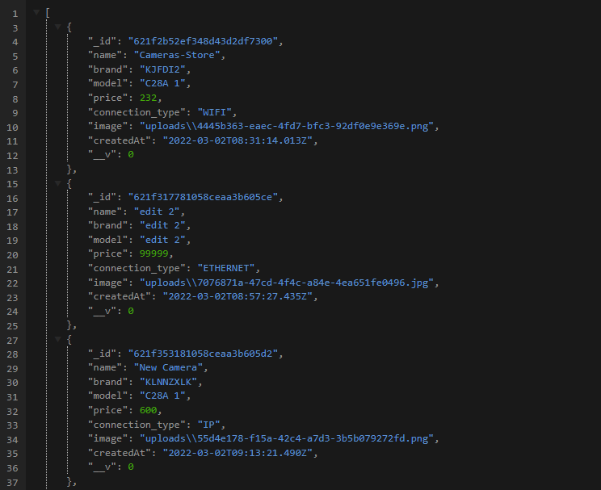

# Express with Typescript and MongoDB   

## Table of Content

- [About The Project](#about-the-project)
  - [Description](#description)
  - [Built With](#built-with)
- [Installation](#installation)
- [Usage](#usage)
- [API Reference](#api-reference)
- [Contact](#contact)

## About The Project



## Description

This project is from a camera store, which I did to practice using the Express framework together with Typescript connected to MongoDB as a database.

The application performs CRUD-type queries and then returns them to the REST API endpoints. In addition, in the endpoint requests, it accepts the blob file type to save images in the database.

## Built With

[](https://nodejs.dev)

[](https://expressjs.com)

[](https://www.typescriptlang.org)

[](https://www.mongodb.com)

## Installation

1. Clone the repo and change "my-project" to your project name.

```sh
  git clone https://github.com/josemiguel02/nodejs-express-ts-mongodb.git ./my-project
```

2. Go to the project directory

```sh
  cd my-project
```

3. Install NPM packages

```sh
  yarn install
```

4. Add the following environment variables to your .env file

`DB_URI`

`DB_USER`

`DB_PASSWORD`

## Usage

Run the project in development

```
  yarn dev
```

Build the project

```
  yarn build
```

## API Reference

### Get all cameras

```
  GET /api/cameras
```

### Create a camera

```
  POST /api/cameras/add
```

### Edit a camera

```
  PUT /api/cameras/edit/:id
```

| Parameter | Type     | Description                |
| :-------- | :------- | :------------------------- |
| `id`      | `string` | **Required**. ID of camera |

### Delete a camera

```
  DELETE /api/cameras/delete/:id
```

| Parameter | Type     | Description                |
| :-------- | :------- | :------------------------- |
| `id`      | `string` | **Required**. ID of camera |

## Contact

- Gmail - [josemidev24@gmail.com](mailto:josemidev24@gmail.com)
- Instagram - [@jmdp.02](https://www.instagram.com/jmdp.02)
